# DS2 - 2019-20

[[Sujet du ds]](https://moodle1.u-bordeaux.fr/pluginfile.php/932416/mod_resource/content/1/2019-20%20BD%20S3%20DS2.pdf)

---

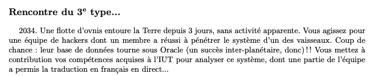

---

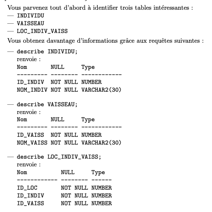

---

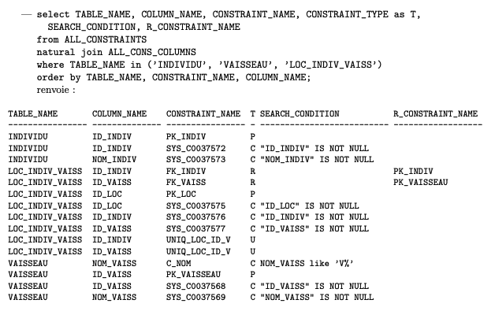

## Exercice 1

### 1/ Créer un utilisateur

> Utilisateur `U256` avec comme mot de passe `District9`

```sql
create user U256 identified by District9;
```

### 2/ Privilèges de connexion

> Comment se nomme le privilege necessaire a un utilisateur pour qu’il puisse se connecter ?

- `CREATE SESSION` et `CONNECT`

### 3/ Ajouter les privilèges à l'utilisateur

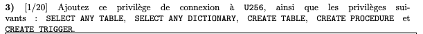

```sql
grant
CREATE SESSION
SELECT ANY TABLE, 
SELECT ANY DICTIONARY, 
CREATE TABLE, 
CREATE PROCEDURE
CREATE TRIGGER
to U256;
```

### 4/ Afficher les privilèges de l'utilisateur

```sql
select * from DBA_SYS_PRIVS where grantee = 'U256';
```

## Exercice 2

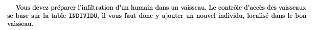

### 5/ Créer un individu (table)

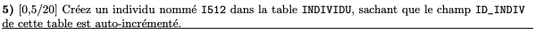

```sql
insert into INDIVIDU (NOM_INDIV) values ('I512');
```

### 6/ Ajoutez la localisation d'un vaisseau

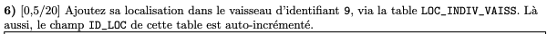

```sql
insert into LOC_INDIV_VAISS (ID_INDIV, ID_VAISS) values (
    (select ID_INDIV from INDIVIDU where NOM_INDIV = 'I512'),
    9
)
```

## Exercice 3

### 9/ Afficher le nombre de privilèges pour chaque compte

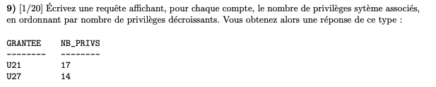

```sql
select GRANTEE, count(*) as NB_PRIVS
from DBA_SYS_PRIVS
group by GRANTEE
order by NB_PRIVS desc
```

### 10/ Retirer des privilèges

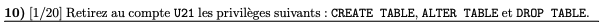

```sql
revoke CREATE TABLE, ALTER TABLE, DROP TABLE from ETD;
```

## Exercice 4

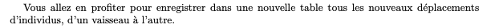

### 11/ Créer une table `CHANGE_LOC`

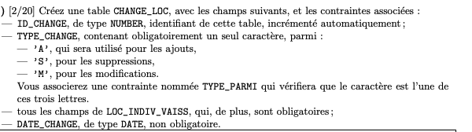

```sql
create table CHANGE_LOC (
    ID_CHANGE number generated always as identity,
    TYPE_CHANGE char(1) not null,
    ID_LOC number not null
    ID_INDIV number not null
    ID_VAISS number not null
    DATE_CHANGE date,
    constraint PK_CHANGE_LOC primary key(ID_CHANGE),
    constraint TYPE_PARMI check (TYPE_CHANGE in ('A', 'S', 'M'))
);
```

### 12 / Ajouter un déclencheur

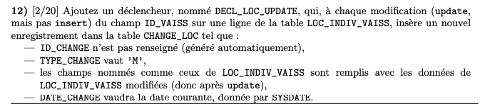

```sql
create or replace trigger DECL_LOC_UPDATE
after update
on LOC_INDIV_VAISS
for each row
begin
    insert into CHANGE_LOC (TYPE_CHANGE, 
                            ID_LOC, 
                            ID_INDIVIDU, 
                            ID_VAISS, 
                            DATE_CHANGE)
    values ('M', 
            :new.ID_LOC, 
            :new.ID_INDIVIDU, 
            :new.ID_VAISS, 
            SYSDATE
    );
end;
```

### 13/ Ecrire une fonction

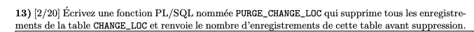

```sql
create or replace function PURG_CHANGE_LOC()
return NUMBER
    is total_purged number;
begin
    select count(*) into total_purged
    from CHANGE_LOC;

    delete from CHANGE_LOC;

    return total_purged;
end;
```

## Exercice 6

### 16/ Plan d'éxécution

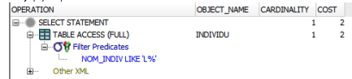

```sql
select NOM_INDIV from INDIVIDU
where NOM_INDIV LIKE 'L%'
```
