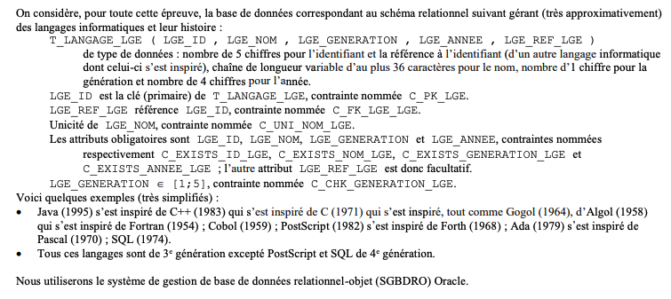
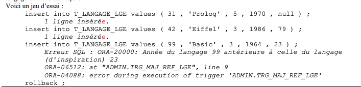
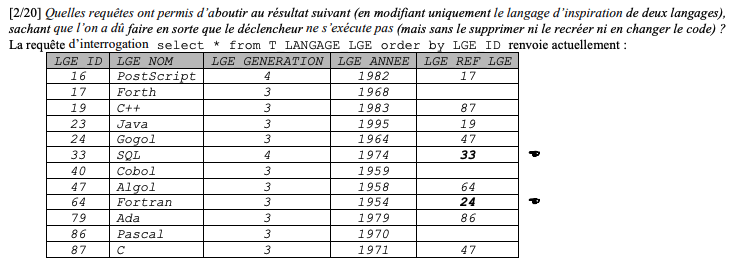
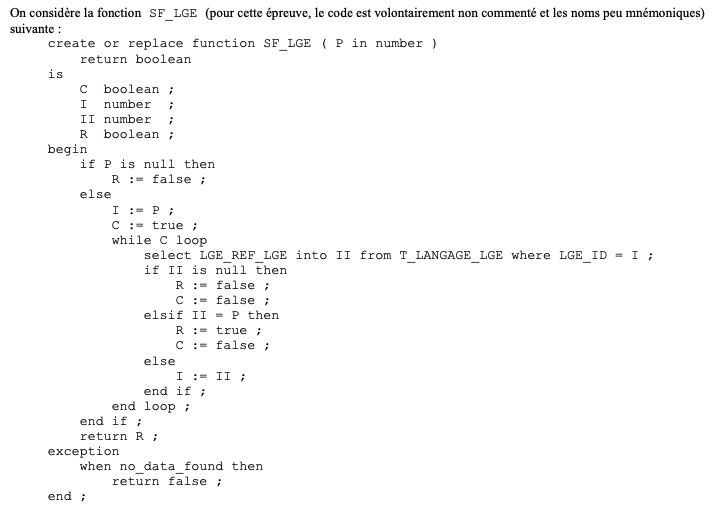
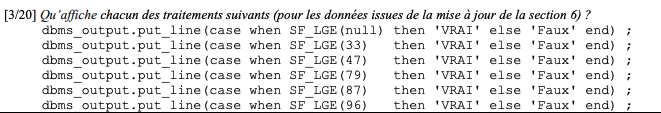
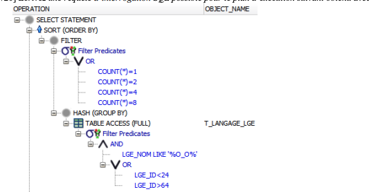

# DS2 - 2020-21

[[Sujet du ds]](https://moodle1.u-bordeaux.fr/pluginfile.php/984574/mod_resource/content/3/2020-21%20BD%20S3%20DS2.pdf)

---



### 1 / Ecrire la requête de création de `T_LANGAGE_LGE`

Le but est de récupérer données et contraintes pour chaques colonnes de la table a créer :

> En gros comprendre le sujet qui comme d'hab est mal rédigé, mal formatté...

**Etape 1 : trier les informations (Décoder le Guibert)** :

| Colonne          | Type          | Contrainte      | Nom contrainte                    |
| ---------------- | ------------- | --------------- | --------------------------------- |
| `LGE_ID`         | `NUMBER(5)`   | P, C (not null) | `C_PK_LGE` `C_EXISTS_ID_LGE`      |
| `LGE_NOM`        | `VARCHAR(36)` | U, C (not null) | `C_UNI_NOM_LGE``C_EXISTS_NOM_LGE` |
| `LGE_GENERATION` | `NUMBER(1)`   | C (not null)    | `C_EXISTS_GENERATION_LGE`         |
| `LGE_ANNEE`      | `NUMBER(4)`   | C (not null)    | `C_EXISTS_ANNEE_LGE`              |
| `LGE_REF_LGE`    | `NUMBER(5)`   | R               | `C_FK_LGE_LGE`                    |

> Rappel sur les types de contraintes :
> 
> - R : clé étrangère
> 
> - U : unique
> 
> - P : clé primaire
> 
> - C : autres

**Etape 2 : Faire la requête (répondre à la question) :**

```sql
create table T_LANGAGE_LGE (
    LGE_ID NUMBER(5) constraint C_EXISTS_ID_LGE not null,
    LGE_NOM VARCHAR(36) constraint C_EXISTS_NOM_LGE not null,
    LGE_GENERATION NUMBER(1) constraint C_EXISTS_GENERATION_LGE not null,
    LGE_ANNEE NUMBER(4) constraint C_EXISTS_ANNEE_LGE not null,
    LGE_REF_LGE NUMBER(5),
    constraint C_PK_LGE primary key(LGE_ID),
    constraint C_UNI_NOM_LGE unique (LGE_NOM),
    constraint C_FK_LGE_LGE foreign key (LGE_REF_LGE) references T_LANGAGE_LGE(LGE_ID)
);
```

---

### 2/ Créer un nouvel utilisateur et donner des droits

> Créer utilisateur `ETD` avec comme mdp `1234`

> Droits a accorder : `select` `insert` `alter`

```sql
create user ETD identified by "1234";
```

```sql
grant select, insert, alter on T_LANGAGE_LGE to ETD;
```

---

### 3/ Insérer 2 langages dans la table

> PostScript (1982) de 4ème génération, identifiant 16, inspiré de Forth (1968) de 3ème génération et d'identifiant 17.

> Comme PostScript est inspiré de Forth, il faut d'abord ajouter Forth

```sql
insert into T_LANGAGE_LGE values (
    17,
    'Forth',
    3,
    1968,
    NULL
);
```

```sql
insert into T_LANGAGE_LGE values (
    16,
    'PostScript',
    4,
    1982,
    17
);
```

---

### 4/ Créer une vue `V_NBR_LGE_GENERATION_LGE`

> V_NBR_LGE_GENERATION_LGE affiche le nombre de lanagages pour chaque génération

```sql
create view V_NBR_LGE_GENERATION_LGE as
select LGE_GENERATION, count(*) as LGE_NBR_LGE_GENERATION 
from T_LANGAGE_LGE
group by LGE_GENERATION;
```

---

### 5/ Créer un déclencheur

> Déclencheur qui évite à un lanagage d'être inséré ou modifié si son année est antérieure à l'année du langage dont il est inspiré.



```sql
create or replace trigger TRG_MAJ_REF_LGE
    before insert or update
    on T_LANGAGE_LGE
    for each row
    WHEN (NEW.LGE_REF_LGE is not null)
declare
    ANNEE_PREC number(5);
begin
    select LGE_ANNEE 
    into ANNEE_PREC 
    from T_LANGAGE_LGE 
    where LGE_ID = :new.LGE_REF_LGE;

    if :new.LGE_ANNEE < ANNEE_PREC then 
        RAISE_APPLICATION_ERROR(-20000, 'Année du langage ' 
            || :new.LGE_ID || ' antérieure à celle du langage (d''inspiration) '
            || :new.LGE_REF_LGE);
    end if;
end;
```

---

### 6/ Mise à jours des données incohérentes



> 33 (SQL) se référence lui même.

> 64 (Fortant) a sa date de création avant la date de création de son langage d'inspiration 24 (Gogol).

- 1 : Faire référencer SQL sur lui même :
  
  - ```sql
    update T_LANGAGE_LGE
    set LGE_REF_LGE = 33
    where LGE_ID = 33;
    ```

- 1 : Changer l'année de Algol pour qu'il soit avant Fortran :
  
  - ```sql
    update T_LANGAGE_LGE
    set LGE_ANNEE = 1954
    where LGE_ID = 47;
    ```

- 2 : Changer l'année de Gogol :
  
  - ```sql
    update T_LANGAGE_LGE
    set LGE_ANNEE = 1954
    where LGE_ID = 24;
    ```

- 3 : Ajout du langage d'inpiration de Gogol :
  
  - ```sql
    update T_LANGAGE_LGE
    set LGE_REF_LGE = 24
    where LGE_ID = 64;
    ```

- 4 : Rétablir l'année d'Algol :
  
  - ```sql
    update T_LANGAGE_LGE
    set LGE_ANNEE = 1958
    where LGE_ID = 47;
    ```

- 5 : Rétablir l'année de Gogol :
  
  - ```sql
    update T_LANGAGE_LGE
    set LGE_ANNEE = 1964
    where LGE_ID = 24;
    ```

---

### 7/ Fonctions/Procédures stockées





| null    | 33     | 47     | 79      | 87              | 96      |
| ------- | ------ | ------ | ------- | --------------- | ------- |
| `false` | `true` | `true` | `false` | *boucle infini* | `false` |

---

### 8/ Optimiseur de requêtes d'interrogation



```sql
select LGE_NOM, count(*) 
from k_t_langage_lte
where LGE_NOM like '%O_O' and
(LGE_ID < 24 or LGE_ID > 64)
group by LGE_NOM
having count(*) in (1,2,4,8)
```


```sql
select P.LGE_NOM Père, E.LGE_NOM as Fils,
        PE.LGE_NOM as Petit_Fils
from T_LANGAGE_LGE P
left outer join T_LANGAGE_LGE E on E.LGE_REF_LGE = P.LGE_ID
left outer join T_LANGAGE_LGE PE on PE.LGE_REF_LGE = E.LGE_ID;
```


