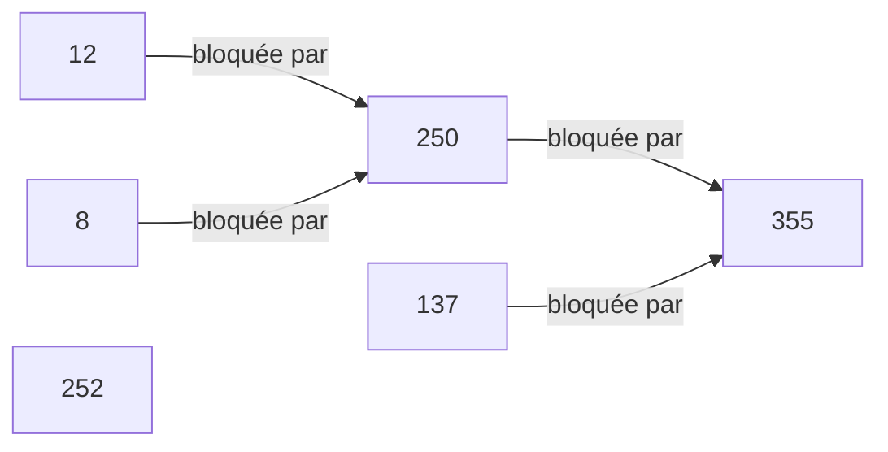
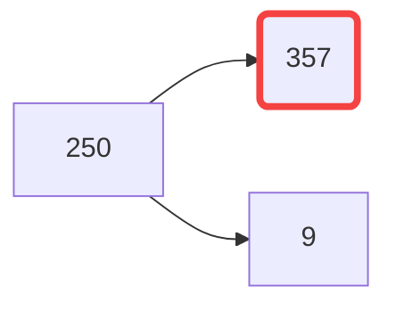
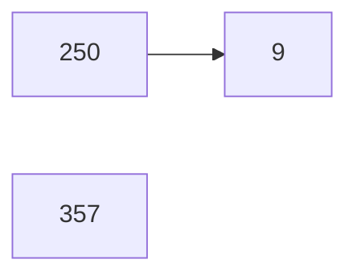

# Base de données avancées

<u>Base de données</u> : Ensemble d'informations structurées

---

## 1/ Vue

 **Synthèse** d'une **requête d'interrogation** de la base sous forme de **table**. 

> On peut la voir comme une table virtuelle, définie par une requête.

- permet de nommer une requête et de s'en servir par la suite comme une table

- de mettre en cache une requête

- de masquer certaines données à certains utilisateurs

> Les **vues** s'utilisent pratiquement comme des tables (elles peuvent être dans une clause `FROM` d'un `SELECT`, dans un `UPDATE`, etc)

<u>Exemple :</u>

On peut créer une vue à partir d'une requête :

```sql
CREATE VIEW ToutLeMonde AS 
         SELECT e.nom as Employe, d.nom as Departement 
                FROM Employes e,Departements d 
                WHERE e.departement = d.id;
```

On peut alors utiliser cette vue comme si il sagissait d'une table faisant partie de la BD.

```sql
SELECT * FROM ToutLeMonde ;
```

#### Vues du dictionnaire des données Oracle

| Vue                | description                                               |
| ------------------ | --------------------------------------------------------- |
| `ALL_TABLES`       | toutes les tables accessibles par l'utilisateur courant   |
| `ALL_VIEWS`        | toutes les vues accessible à l'utilisateur courant        |
| `ALL_TAB_PRIVS`    | Donne pour chaque tables ses privilège d'accès            |
| `ALL_CONSTRAINTS`  | Donne les contraintes des tables                          |
| `ALL_CONS_COLUMNS` | Donne toutes les colonnes qui sont liées à une contrainte |
| `ALL_TAB_COLS`     | Donne toutes les colonnes de toutes les tables            |

> Pour avoir des infos sur les colonne d'une table ou d'une vue
> 
> ```sql
> describe VIEW_OR_TABLE_NAME
> ```

---

## 2/ Dictionnaire des données

**Ensemble** de **tables** et de **vues** :

- y sont stockées les descriptions des objets de la base

- sont tenues à jour automatiquement par le système de gestion de bases de données.

> Tous les systèmes de gestion de bases de données relationnels contiennent un dictionnaire de données intégré.


---

## 3/ Contraintes d'intégrité

**Contrainte d'intégrité** : régle qui définir la cohérence d'une données ou d'un ensemble de données de la bd.

- Il existe 4 types de contraintes d'intégrité :

| ID  | Nom                      | Description                                                                                                         |
| --- | ------------------------ | ------------------------------------------------------------------------------------------------------------------- |
| P   | Primary key              | Définit un attribut comme la clé primaire d'une table                                                               |
| U   | Unique                   | Interdit à deux linges de la tables d'avoir la même valeurs sur l'attribut référencé comme unique                   |
| R   | References (Foreign Key) | Oblige un attribut qui référence une autre table à être valide (La clé étrangère doit pointer vers qqch qui existe) |
| C   | Check                    | Autres types de restrictions sur un attribut                                                                        |

```sql
CREATE TABLE Personne (
    ID CHAR(13) PRIMARY KEY, // contrainte 'P'
    Nom VARCHAR(25) NOT NULL, // 'C'
    Prenom VARCHAR(25) NOT NULL, // 'C'
    Age INTEGER(3) CHECK (Age BETWEEN 18 AND 65),
    Mariage CHAR(13) REFERENCES Personne(ID), // 'R'
    UNIQUE (Nom, Prenom) // 'U'
);
```

---

## 4/ Privilèges

Autorisation donnée à un utilisateur de la BD.

- Utilisateur = quelqu'un qui a des droits (Compte).

```sql
select TABLE_NAME , GRANTOR , GRANTEE , PRIVILEGE
from ALL_TAB_PRIVS
where TABLE_NAME in ( 'PLACE' , 'SEANCE' , 'RESERVATION' )
order by TABLE_NAME , GRANTOR , GRANTEE , PRIVILEGE ;
```

Le dictionnaire de données contient la vue `ALL_TAB_PRIVS`

## 5/ Sessions et Transactions

**Session** : Connexion unique maintenue avec la base de données par un utilisateur.

**Transaction** : Ensemble de requêtes de mise à jour qui snt traitées comme une seule unité.

- Toutes les requête d'une transaction doivent réussir sinon aucune ne sera validé

- Une transaction est un ensemble de changements dans la BD qui ne sont pas encore validés

Pour valider les changements et les rendre permanents :

```sql
commit -- Make the changes permanent
```

Pour annuler les changements :

```sql
rollback -- Undo changes
```

> Voir ça comme git, pour valider ses changement il faut commit, et bah ici au lieu de modifier des fichier on modif la BD avec des requêtes.

#### Bloquage (Transaction concurrency) :

Dans un BD avec 1 seul user :

- On peut modifier ce que l'on veut quand on veut.

Dans une BD avec plusieurs users :

- Plusieurs transactions peuvent vouloir modifier les même données au même moment. C'est le cas quand il y a **plusieurs sessions actives**.

- Le résultat doit rester clair malgrès tout, c'est pouquoi il y a un **contrôle de l'ordre de passage des transactions**.

> une transaction peut donc être bloquée par une autre si elles touchent au mêmes données. Dans ce cas, une est prioritaire sur l'autre, et l'autre est bloqué tant que la première n'est pas terminée.

#### Graphe d'attente des transactions :

> Exercice 38




Explication ligne par ligne (du tableau) :

- La transaction de la session 250 est bloquée par la session 355

- 252 par personne

- 137 par 355

- 12 par 250

- ...

> `final_blocking_sessions` est l'origine du bloquage

##### Graphe d'attente : autre exemple

> Exercice 39 :

Trois sessions effectuent les transaction suivantes :

- TEMPS 1 = `sid 357`
  
  - ```sql
    update RESERVATION set NOM_SPECTATEUR='un' where NUMERO_SEANCE=1 
    ```

- TEMPS 2 = `sid 9`
  
  - ```sql
    update RESERVATION set NOM_SPECTATEUR='deux' where NUMERO_SEANCE=2
    and NUMERO_PLACE=16
    ```

- TEMPS 3 = `sid 250`
  
  - ```sql
    update RESERVATION set NOM_SPECTATEUR='trois'
    where (NUMERO_SEANCE=1 and NUMERO_PLACE=8) 
    or (NUMERO_SEANCE=2 and NUMERO_PLACE=16) 
    ```

Ici :

- 357 est bloqué par personne

- 9 est bloquée par personne (Touche pas les mm données que 357)

- 250 est bloquée par 357 (num séance) et/ou 250 (num séance et place)

Le graphe suivant  est intuitif mais **faux** :



> 1 sommet = 1 parent **MAX**
> 
> Il faut donc prendre le plus proche dans l'ordre d'exécution



## 6/ Procédures stockées

Une procédure est un regroupement de requêtes sql que l'on peut éxécuter ensembles. 

> Voir ça comme un script bah qui lui peut éxécuter plusieurs commande bash, ici c'est pareil mais avec des requêtes sql.

> A la manière d'une fonction ou d'un scritp bash, une procèdure peut prendre des arguments et simplement être appelée pour être éxécutée.

**Exemple utilisation de procédure :**

> Exo 41

`INSER_1_RESA_OBLIG` est une procédure permettant d'inserer une réservation avec juste numéro de séance et de place

- ```sql
  execute INSER_1_RESA_OBLIG(10, 100); --Exemple d'appel
  ```

- ```sql
  describe INSER_1_RESA_OBLIG --Pour avoir des détails
  ```
  
  - 

Les procédure stockées permettent de faciliter le développement mais aussi d'offrir de meilleurs performances / sécurité.

## 7/ Déclencheurs

Déclenche une procédure à partir d'un certain événement

---

- [x] Transaction

- [ ] index

- [ ] requetage

- [ ] plan d'execution

- [x] graphe

- [x] contrainte d'integrité

- [ ] regles de gestion

- [ ] delcencheurs
