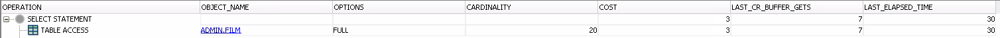
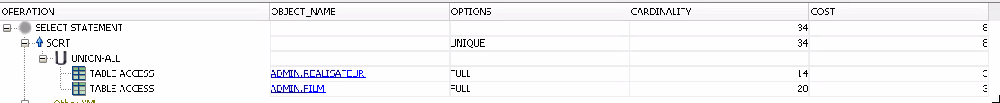
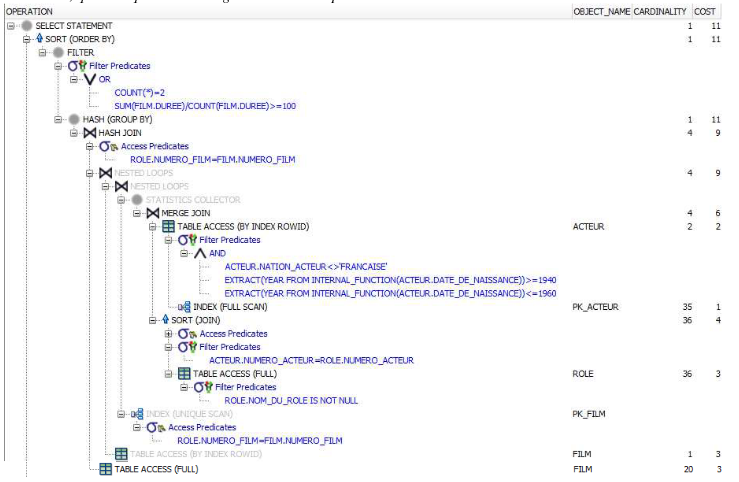
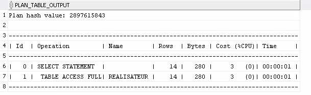

## TD3 - Plan d'éxécution d'une requête

---

**2)** Chercher plan d'éxécution des requêtes suivantes

```sql
select *
from FILM;
```



```sql
select NOM_REALISATEUR , PRENOM_REALISATEUR
from REALISATEUR
union
select TITRE_FILM , GENRE
from FILM
```



> UnionAll => union mais on garde les doublons

**3)** Requête correspondant au plan d'éxécution suivant



```sql
select count(*) from film
inner join role on role.numero_film = film.numero_film
inner join acteur on acteur.numero_acteur = role.numero_acteur
where role.nom_du_role is not null
and acteur.nation_acteur <> 'FRANCAISE'
and extract (year from acteur.date_de_naissance) >= 1940
and extract (year from acteur.date_de_naissance) <= 1960
group by film.duree
having sum(film.duree) / count(film.duree) >= 100 or count(*) = 2
```

**6)** Commentez les requêtes 

```sql
explain plan for
select PRENOM_REALISATEUR
from REALISATEUR
```

```sql
select * from TABLE(DBMS_XPLAN.DISPLAY)
```




**8)** Analyse de tables et indexes


