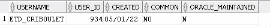
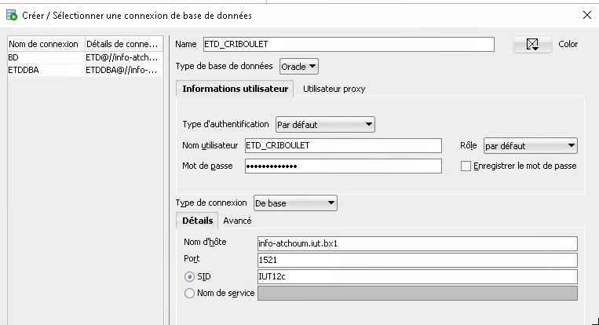
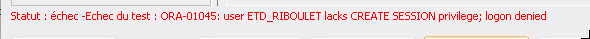
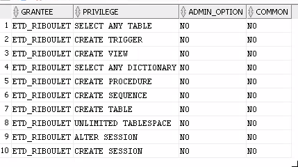
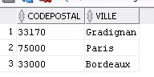
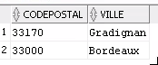
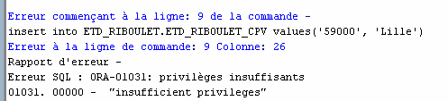
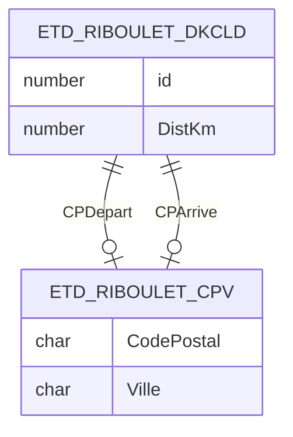

# TD2 Base de données

## B/ Dictionnaire des donées sur les privilèges

**3)** Que fait la requête

```sql
select 'Connecté ' || sys_context('USERENV','OS_USER'), 
UID , USER ,SYSDATE , SYSTIMESTAMP, bitand(170,102)
from DUAL
```

Elle affiche quand l'utilisateur de l'ordinateur s'est connecté avec quel utilisateur de la BD.

```sql
describe DUAL
```

```
Nom   NULL ? Type        
----- ------ ----------- 
DUMMY        VARCHAR2(1) 
```

DUMMY = factice (La table DUAL n'existe pas vraiment)

**4)** Afficher les privilèges de ETDDBA

```sql
select * from DBA_SYS_PRIVS where grantee = 'ETDDBA'
```

```sql
select * from DBA_SYS_PRIVS where grantee = 'ETD'
```

```
ETD    SELECT ANY TABLE        NO    NO
ETD    CREATE SESSION            NO    NO
ETD    SELECT ANY DICTIONARY    NO    NO
```

**5)** Afficher tous les privilèges systèmes de l'utilisateur DBA que n'a pas l'utilisateur ETDDBA

```sql
select * from DBA_SYS_PRIVS where grantee = 'DBA'
minus
select * from DBA_SYS_PRIVS where grantee = 'ETDDBA';
```

**6)** Afficher les privilèges objets (Tables et privilèges associés) attribués à ETD par ADMIN

```sql
select * from DBA_TAB_PRIVS where grantee = 'ETD' and grantor = 'ADMIN';
```

```sql
select * from DBA_TAB_PRIVS where grantee = 'ETDDBA' and grantor = 'ADMIN';
```

Droits de `ETD` sur `RESERVATION` :

- INSERT

- DELETE

- SELECT

- UPDATE

Droits de `ETD` sur `ACTEUR` :

- SELECT

**7)** Créer une nouvelle table

```sql
create table test_table (
champ number
);
```

```sql
drop table test_table;
```

**8)** Essayer de supprimer `reservation`

```sql
drop table reservation;
```

## C / Création d'utilisateur

**9)** Créer un nouvel utilisateur

```sql
create user ETD_RIBOULET identified by ETD_RIBOULET;
```

**10)** Afficher le nouvel utilisateur

```sql
select * from ALL_USERS where username = 'ETD_RIBOULET';
```



**11)** Connexion au nouvel utilisateur



Mais l'utilisateur na pas les droits de se connecter



## D) Attribution de privilièges

**13)** Afficher tous les provilèges systèmes de l'utilisateur

```sql
select * from DBA_SYS_PRIVS where grantee = 'ETD_RIBOULET';
```

> L'utilisateur a aucun droits

**14)** Assignation des privilèges

```sql
GRANT 
SELECT ANY TABLE,
SELECT ANY DICTIONARY,
CREATE SESSION,
ALTER SESSION,
CREATE TABLE,
CREATE VIEW, 
CREATE PROCEDURE, 
CREATE TRIGGER,
CREATE SEQUENCE,
UNLIMITED TABLESPACE 
TO ETD_RIBOULET;
```

```sql
select * from DBA_SYS_PRIVS where grantee = 'ETD_RIBOULET';
```



**15)** Ouvrir une connexion avec `ETD_CRIBOULET`

> Comme question 11 mais cette fois ci on peut se connecter

## E/ Définition des données

> A partir de maintenant on est connecté sur le compte `ETD_CRIBOULET`

**17)** Créer une table

```sql
create table ETD_RIBOULET_CPV (
    CodePostal CHAR(5) NOT NULL,
    Ville VARCHAR(30),
    CONSTRAINT PK_RIBOULET_CPV PRIMARY KEY(CodePostal)
);
```

## F/ Gestion des privilèges

**18)** Insérer ville de Gradignan (33170) et Paris (75000) dans la table `ETD_RIBOULET_CPV` 

```sql
insert into ETD_RIBOULET_CPV values ('33170', 'Gradignan');
insert into ETD_RIBOULET_CPV values ('75000', 'Paris');
```

**19)** Créer une vue permettant d'afficher touts les informations de la table `ETD_RIBOULET_CPV`

```sql
create view ETD_RIBOULET_CPV_GIRONDE AS 
select * from ETD_RIBOULET_CPV where CodePostal like '33%';
```

```sql
select * from ETD_RIBOULET_CPV_GIRONDE;
```

**20)** Accorder à ETD les privilèges 

- `INSERT` et `SELECT` sur `ETD_RIBOULET_CPV`
  
  - ```sql
    grant SELECT, INSERT on ETD_RIBOULET_CPV to ETD;
    ```

- `SELECT` sur `ETD_RIBOULET_CPV_GIRONDE`
  
  - ```sql
    grant SELECT on ETD_RIBOULET_CPV_GIRONDE to ETD;
    ```

**21)** Ouverture de session sur `ETD` 

> On est sur `ETD` à partir de maintenant

**22)** Insérer dans la table depuis `ETD`

```sql
insert into ETD_RIBOULET.ETD_RIBOULET_CPV values ('33000', 'Bordeaux');
```

```sql
commit
```

**23)** Afficher toutes les lignes depuis `ETD`

```sql
select * from ETD_RIBOULET.ETD_RIBOULET_CPV;
```



**24)** Récupérer toutes les villes de gironde

```sql
select * from ETD_RIBOULET.ETD_RIBOULET_CPV_GIRONDE;
```



**25)** Retirer les privilèges à un utilisateur

> On est sur `ETD_RIBOULET` a partir de maintenant

```sql
revoke INSERT on ETD_RIBOULET_CPV from ETD;
```

**26)** Essayer en tant que `ETD` d'inserer dans la table

```sql
insert into ETD_RIBOULET.ETD_RIBOULET_CPV values('59000', 'Lille');
```



## J/ Définition des données : table, contraintes d'intégrités, index

> Sur `ETD_RIBOULET`

**49)** Ajouter contrainte d'intégrité sur la colonne Ville de la table `ETD_RIBOULET_CPV`

```sql
alter table ETD_RIBOULET_CPV modify Ville varchar(30) not null;
```

```sql
alter table ETD_RIBOULET_CPV 
add constraint "EXISTS_RIBOULET_VILLE" check (Ville is not null);
```

```sql
insert into ETD_RIBOULET_CPV values ('12348', NULL);
```

> Erreur

Création de la table `ETD_RIBOULET_DKCLD`

```sql
create table ETD_RIBOULET_DKCLD (
    Id number generated always as identity,
    CPDepart CHAR(5) not null,
    CPArrivee CHAR(5) not null,
    DistKm number(5) not null,
    constraint PK_RIBOULET_DKCLD primary key(Id),
    constraint FK_RIBOULET_CPDepart 
        foreign key (CPDepart) references ETD_RIBOULET_CPV(CodePostal),
    constraint FK_RIBOULET_CPArrivee 
        foreign key (CPArrivee) references ETD_RIBOULET_CPV(CodePostal),
    constraint CI_RIBOULET_CPDepartCPArrivee 
        check (CPDepart < CParrivee),
    constraint CI_RIBOULET_CPDepart000 
        check (CPDepart like '%000'),
    constraint CI_RIBOULET_CPArrivee000 
        check (CPArrivee like '%000'),
    constraint UNIQ_RIBOULET_CodePostaux 
        unique (CPDepart, CPArrivee)
);
```

```sql
create index INDX_RIBOULET_DistKm on ETD_RIBOULET_DKCLD(DistKm);
```



**50)** Inserer des villes

```sql
insert into ETD_RIBOULET_CPV values ('06000', 'Nice');
insert into ETD_RIBOULET_CPV values ('13000', 'Marseille');
insert into ETD_RIBOULET_CPV values ('69000', 'Lyon');
insert into ETD_RIBOULET_CPV values ('31000', 'Toulouse');
```

**51)** Insérer distance entre les villes

```sql
insert into ETD_RIBOULET_DKCLD (cpdepart, cparrivee, distkm) values('13000', '33000', 657);
insert into ETD_RIBOULET_DKCLD (cpdepart, cparrivee, distkm) values('33000', '69000', 549);
insert into ETD_RIBOULET_DKCLD (cpdepart, cparrivee, distkm) values('33000', '75000', 559);
insert into ETD_RIBOULET_DKCLD (cpdepart, cparrivee, distkm) values('06000', '75000', 687);
insert into ETD_RIBOULET_DKCLD (cpdepart, cparrivee, distkm) values('13000', '75000', 769);

commit;
```

**52)** Test des contraintes sur `ETD_RIBOULET_DKCLD`

> Toutes les requêtes suivantes ne doivent pas passer

```sql
insert into ETD_RIBOULET_DKCLD (cpdepart, cparrivee, distkm) 
values(null, '33000', 0);
insert into ETD_RIBOULET_DKCLD (cpdepart, cparrivee, distkm) 
values('33000', null, 0);
insert into ETD_RIBOULET_DKCLD (cpdepart, cparrivee, distkm) 
values('06000', '33000', null);
insert into ETD_RIBOULET_DKCLD (cpdepart, cparrivee, distkm) 
values('00000', '33000', 0);
insert into ETD_RIBOULET_DKCLD (cpdepart, cparrivee, distkm) 
values('00000', '99000', 0);
insert into ETD_RIBOULET_DKCLD (cpdepart, cparrivee, distkm) 
values('33175', '69000', 0);
insert into ETD_RIBOULET_DKCLD (cpdepart, cparrivee, distkm) 
values('33000', '33175', 0);
insert into ETD_RIBOULET_DKCLD (cpdepart, cparrivee, distkm) 
values('33000', '06000', 0);
insert into ETD_RIBOULET_DKCLD (cpdepart, cparrivee, distkm) 
values('33000', '69000', 0);
```

**56)** Créer une fonction qui retourne la distance

```sql
create or replace function ETD_RIBOULET_DK(cp CHAR)
return NUMBER
    is total_km number := 0;
begin
    if CP is null then
        return null;
    end if;
    select sum(distkm) into total_km
    from ETD_RIBOULET_DKCLD
    where cpdepart = cp or cparrivee = cp;
    return total_km;
end;
```

**57)** Test de la fonction

```sql
select 
ETD_RIBOULET_DK('00000'),
ETD_RIBOULET_DK('33175'),
ETD_RIBOULET_DK('31000'),
ETD_RIBOULET_DK('06000'),
ETD_RIBOULET_DK('13000'),
ETD_RIBOULET_DK('33000'),
ETD_RIBOULET_DK('75000'),
ETD_RIBOULET_DK('69000')
from DUAL;
```

> Avec DUAL étant une table contenant une seule ligne => permet d'appeler qu'une seule fois la fonction

**58)** Comphréhension de requêtes

```sql
select OBJECT_NAME , OBJECT_TYPE 
from all_procedures where owner = 'ETD_RIBOULET'
```

> Selectionne tous les objets appartenent à ETD_RIBOULET

**59)** Afficher le code de `ETD_RIBOULET_DK`

```sql
select * from user_source where type='FUNCTION';
```


### L/Déclencheurs

**60)** Créer un déclencheur

```sql
set serveroutput on
```

> Permet de faire fonctionner `DBMS_OUTPUT.PUT_LINE` du trigger

```sql
create or replace TRIGGER ETD_RIBOULET_CPV_INSERT
AFTER
INSERT OR UPDATE
ON ETD_RIBOULET_CPV
FOR EACH ROW
BEGIN
    IF :new.CODEPOSTAL like '%000' THEN
        DBMS_OUTPUT.PUT_LINE('Ce chef-lieu de departement doit etre ajoute a la table des distances');
    END IF;
END;
```

**61)** Test du déclencheur

```sql
insert into ETD_RIBOULET_CPV values ('67000', 'Strasbourg'); // Trigger
insert into ETD_RIBOULET_CPV values ('44999', 'Nantes'); // Pas trigger
update ETD_RIBOULET_CPV set CODEPOSTAL = '44000' // Trigger
where CODEPOSTAL = '44999';
```


### M/ Destruction d'une base de données

**63)** Retirer à `ETD` les privilèges objets `SELECT` et `INSERT` sur la table `ETD_RIBOULET_CPV` 

```sql
revoke SELECT, INSERT on ETD_RIBOULET_CPV from ETD
```

Supprimer les privilèges select sur `ETD_RIBOULET_CPV_GIRONDE`

```sql
revoke SELECT on ETD_RIBOULET_CPV_GIRONDE from ETD
```

**64)** Supprimer toutes les données de `ETD_RIBOULET_DKCLD` et `ETD_RIBOULET_CPV`

```sql
delete from ETD_RIBOULET_DKCLD;
delete from ETD_RIBOULET_CPV;
commit;
```

**65)** 


**66)** Détruire le déclencheur `ETD_RIBOULET_CPV_INSERT`

```sql
drop trigger ETD_RIBOULET_CPV_INSERT;
```

**67)** Détruire la fonction `ETD_RIBOULET_DK`

```sql
drop function ETD_RIBOULET_DK;
```

**68)** Détruire la vue `ETD_RIBOULET_CPV_GIRONDE`

```sql
drop view ETD_RIBOULET_CPV_GIRONDE;
```

**69)** Détruire l'index `NDX_RIBOULET_DistKm`

```sql
drop index INDX_RIBOULET_DistKm;
```

**70)** Détruire la table et ses contraintes en cascade `ETD_RIBOULET_DKCLD`

```sql

```
