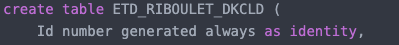

## BD Cheat Sheet

> Tout ce qu'il faut apprendre par <3

---

## 0/ Types

| Types        | Description                                              |
| ------------ | -------------------------------------------------------- |
| `number`     | Nombre de n'import qu'elle taille                        |
| `number(x)`  | Nombre de X caractère **au maximum** `number(3)` : `890` |
| `char(x)`    | String de x caractères (Pas plus pas moins)              |
| `varchar(x)` | String de 1 à X caractères                               |
| `date`       | Date                                                     |

---

## 1/ Create table

```sql
create table NOM_TABLE (
    <COLONNE> <TYPE>,
    <COLONNE> <TYPE> constraint <NOM_CONST> <TYPE_CONST>,
    <COLONNE> <TYPE>,
    constraint <NOM_CONST> <TYPE_CONST>  
);
```

| Constrainte               | Syntaxe                                                                            |
| ------------------------- | ---------------------------------------------------------------------------------- |
| Clé primaire              | `constraint NOM_CONST primary key(COLONNE)`                                        |
| Clé étrangère             | `constraint NOM foreign key (COLONNE) references AUTRE_TABLE(COLONNE_AUTRE_TABLE)` |
| Unicité                   | `constraint NOM unique (COLONNE)`                                                  |
| Unicité couple de colonne | `constraint NOM unique (COLONNE1, COLONNE2)`                                       |
| Check                     | `constraint NOM check (<expression booléenne>)`                                    |

- **Auto incrémentation** :



- **Exemples** :

```sql
create table ETD_RIBOULET_CPV (
    CodePostal CHAR(5) NOT NULL,
    Ville VARCHAR(30),
    CONSTRAINT PK_RIBOULET_CPV PRIMARY KEY(CodePostal)
);
```

```sql
create table T_LANGAGE_LGE (
    LGE_ID NUMBER(5) constraint C_EXISTS_ID_LGE not null,
    LGE_NOM VARCHAR(36) constraint C_EXISTS_NOM_LGE not null,
    LGE_GENERATION NUMBER(1) constraint C_EXISTS_GENERATION_LGE not null,
    LGE_ANNEE NUMBER(4) constraint C_EXISTS_ANNEE_LGE not null,
    LGE_REF_LGE NUMBER(5),
    constraint C_PK_LGE primary key(LGE_ID),
    constraint C_UNI_NOM_LGE unique (LGE_NOM),
    constraint C_FK_LGE_LGE foreign key (LGE_REF_LGE) references T_LANGAGE_LGE(LGE_ID)
);
```

```sql
create table ETD_RIBOULET_DKCLD (
    Id number generated always as identity,
    CPDepart CHAR(5) not null,
    CPArrivee CHAR(5) not null,
    DistKm number(5) not null,
    constraint PK_RIBOULET_DKCLD primary key(Id),
    constraint FK_RIBOULET_CPDepart 
        foreign key (CPDepart) references ETD_RIBOULET_CPV(CodePostal),
    constraint FK_RIBOULET_CPArrivee 
        foreign key (CPArrivee) references ETD_RIBOULET_CPV(CodePostal),
    constraint CI_RIBOULET_CPDepartCPArrivee 
        check (CPDepart < CParrivee),
    constraint CI_RIBOULET_CPDepart000 
        check (CPDepart like '%000'),
    constraint CI_RIBOULET_CPArrivee000 
        check (CPArrivee like '%000'),
    constraint UNIQ_RIBOULET_CodePostaux 
        unique (CPDepart, CPArrivee)
);
```

---

## 2/ Create user

```sql
create user UN_UTILISATEUR identified by LE_MDP;
```

---

## 3/  Grant & Revoke

- **Donner des privilèges systèmes :**

```sql
grant <PERM>, <PERM> to <USER>
```

```sql
grant
CREATE SESSION,
SELECT ANY TABLE, 
SELECT ANY DICTIONARY, 
CREATE TABLE, 
CREATE PROCEDURE,
CREATE TRIGGER
to U256;
```

- **Droits sur une table**

```sql
grant <PERM>, <PERM> on <TABLE> to <USER>;
```

```sql
grant select, insert, alter on VILLES to UN_UTILISATEUR;
```

- **Enlever droits sur une table**

```sql
revoke <PERM> <PERM> on <TABLE> from <USER>
```

- **Voir les privilèges systemes d'un utilisateur**

```sql
select * from DBA_SYS_PRIVS where grantee = 'UN_USER';
```

- **Voir les privilèges objets d'un utilisateur**

```sql
select * from DBA_TAB_PRIVS where grantee = 'UN_USER';
```

 ---

## 4/ Trigger

> A SQL trigger is **a database object which fires when an event occurs in a database**. We can execute a SQL query that will "do something" in a database when a change occurs on a database table such as a record is inserted or updated or deleted.

> `:new` permet de récupérer l'élèment qui va subir l'action (l'èlement que l'on va insert par exemple)

- Structure simple :

```sql
create or replace trigger <TRIG_NAME>
<before/after> <ACTION> or <ACTION>
on <TABLE_CONCERNEE>
for each row
begin
--code du trigger
end;
```

- Avec une précondition (when):

```sql
create or replace trigger <TRIG_NAME>
<before/after> <ACTION> or <ACTION>
on <TABLE_CONCERNEE>
for each row
when (<CONDITION>)
begin
--code du trigger
end;
```

- Variables du trigger :

```sql
create or replace trigger <TRIG_NAME>
<before/after> <ACTION> or <ACTION>
on <TABLE_CONCERNEE>
for each row
when (<CONDITION>)
declare
    MA_VARIABLE <TYPE>;
begin
    select COLONNE into MA_VARIABLE from UNE_TABLE --...
--code du trigger
end;
```

- Appeler une fonction :

```sql
select 
MA_FONCTION()
from DUAL;
```

> Dual étant une table spéciale avec 1 seule ligne

- Exemple ([DS 2020-21](./DS/2/DS2_2020.md))

```sql
create or replace trigger TRG_MAJ_REF_LGE
    before insert or update
    on T_LANGAGE_LGE
    for each row
    WHEN (NEW.LGE_REF_LGE is not null)
declare
    ANNEE_PREC number(5);
begin
    select LGE_ANNEE 
    into ANNEE_PREC 
    from T_LANGAGE_LGE 
    where LGE_ID = :new.LGE_REF_LGE;

    if :new.LGE_ANNEE < ANNEE_PREC then 
        RAISE_APPLICATION_ERROR(-20000, 'Année du langage ' 
            || :new.LGE_ID || ' antérieure à celle du langage (d''inspiration) '
            || :new.LGE_REF_LGE);
    end if;
end;
```

---

## 5/ Function

> routine that accepts parameters, performs an action, such as a complex calculation, and returns the result of that action as a value

- **Structure simple** :

```sql
create or replace function NOM_FONCTION(<PARAM> <TYPE_PARAM>)
return <TYPE_DE_RETOUR>
    is <VARIABLE> <TYPE_VARIABLE>;
    is <VARIABLE> <TYPE_VARIABLE>;
begin
    -- code fonction
    return UNE_VARIABLE_DU_BON_TYPE;
end;
```

- **Exemple** ([DS 2019-20](./DS/2/DS2_2019.md)):

```sql
create or replace function PURG_CHANGE_LOC()
return NUMBER
    is total_purged number;
begin
    select count(*) into total_purged
    from CHANGE_LOC;

    delete from CHANGE_LOC;

    return total_purged;
end;
```

> Cette fonction permet de supprimer tous les élèments d'une table et retourne le nombre d'élèments supprimés.
